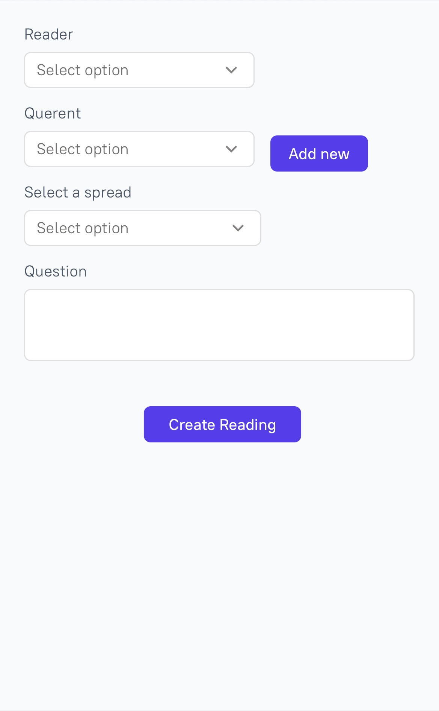
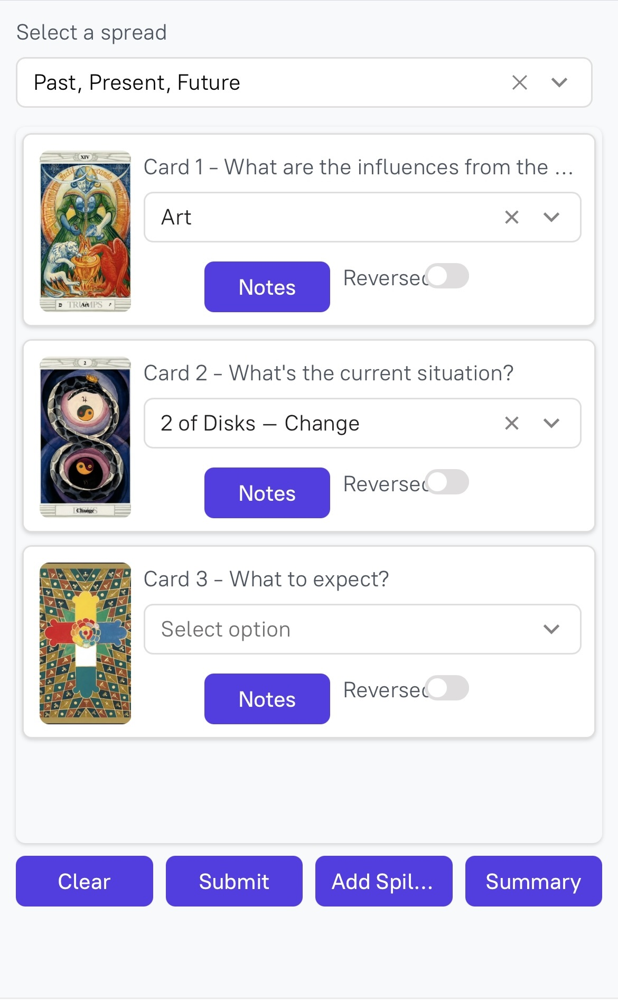
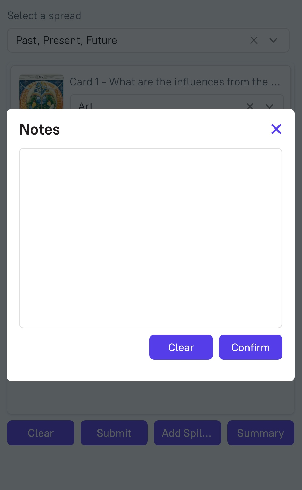
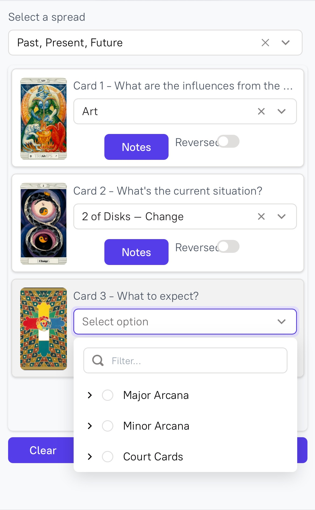

# TarotApp 🃏 - The Tarot Reading Journal

A creative, interactive tarot reading tracker and journal built with [Appsmith](https://www.appsmith.com/) for the frontend and hosted on [Neon](https://neon.tech/) for backend database management.  
This app empowers users to log detailed tarot readings, track cards drawn, and analyze past readings for deep insights. The goal is not only to capture each reading but also to provide data-driven insights into patterns and recurring themes.

---

## 📌 Features

- **Create a Reading**: Select a reader, querent, spread type, and enter a question.
- **Card Logging**: Log each card drawn for a selected spread, including position (e.g., Past, Present, Future), reversed status, and add notes for each card.
- **Custom Spreads**: Create custom tarot spreads with flexible labels and define unique card positions.
- **Reading Summary**: Add a general note to the entire reading to capture the reader’s overall impression.
- **Review Past Readings**: Easily view, search, and filter past readings by querent, reader, spread, or card to uncover patterns and insights.
- **Advanced Data Visualization** (Future Feature): Use data analytics to identify recurring themes, dominant cards, and track the querent's tarot journey over time.

---

## 🔧 How It Works

### 1. **Start a Reading**
   - **Reader** selects key session details such as the reader, querent, spread type, and question.
   - A new **reading record** is created in the `readings` table, capturing all session-specific information, including time and date.

### 2. **Select Cards for the Spread**
   - Based on the chosen **spread**, positions (e.g., Past, Present, Future) are pre-populated with custom labels.
   - For each position, the user selects a **card** from the tarot deck, which is then logged in the **`card_logs` table** along with the card’s **position**, **reversed** status, and **personal notes**.

### 3. **Reading Summary**
   - A **reading note** can be added to the entire reading, offering the reader a chance to reflect on the general energy or overarching theme of the session. This note is stored in the **`readings` table** for easy access later.

### 4. **Review Past Readings (Planned)**
   - Users can view their **past readings**, filterable by querent, reader, spread, or even specific cards, allowing them to reflect on previous sessions and track evolving themes.
   
---

## 🚀 Future Enhancements

- **Data Exploration**: Enable deeper analysis with interactive **data visualizations**. Explore card frequency, connections between spread types and querents, and gain insights into the evolution of readings over time.
- **Predictive Insights**: Add features for **predicting future trends** in a querent’s readings based on historical patterns and card combinations.
- **Advanced Filters**: Implement more granular filtering for queries such as "show all readings with 'The Fool' in the Past position" or "show all readings that included reversed cards."

---

## 📷 Screenshots

| Create Reading | Select Cards UI |
|----------------|-----------------|
|  |  |

| Add Notes | Cards List |
|----------------|------------|
|  |  |

---

## 🛠️ Technologies Used

- **Appsmith**: A powerful low-code platform to rapidly build front-end UIs using drag-and-drop components and integrate custom logic. Appsmith's flexibility allows me to quickly prototype and iterate on new features.
- **PostgreSQL**: The relational database engine used to store readings, cards, and logs. PostgreSQL was chosen for its reliability, extensibility, and its support for complex queries, ensuring the app scales well as data grows.
- **Neon**: Cloud-hosted PostgreSQL database providing seamless scaling and performance for this project.

---

## 🗃️ Database Schema

This app is powered by a robust PostgreSQL database hosted on **Neon**. Below is an overview of the database schema, which leverages **foreign key constraints** for referential integrity and **timestamps** for tracking when readings and logs were created or updated. Key relationships and constraints are outlined to ensure data consistency and efficient querying.

### 1. `readings` Table
This table tracks each **tarot reading session**, linking it to the spread, reader, querent, and their question.

```sql
CREATE TABLE readings (
    id INTEGER PRIMARY KEY GENERATED ALWAYS AS IDENTITY,
    spread_id INTEGER NOT NULL,
    reader_id INTEGER NOT NULL,
    querent_id INTEGER NOT NULL,
    question TEXT,
    notes TEXT,
    created_at TIMESTAMP WITH TIME ZONE NOT NULL DEFAULT CURRENT_TIMESTAMP,
    updated_at TIMESTAMP WITH TIME ZONE NOT NULL DEFAULT CURRENT_TIMESTAMP,
    CONSTRAINT fk_spread FOREIGN KEY (spread_id) REFERENCES public.spreads(id) ON DELETE SET NULL,
    CONSTRAINT fk_reader FOREIGN KEY (reader_id) REFERENCES public.users(id),
    CONSTRAINT fk_querent FOREIGN KEY (querent_id) REFERENCES public.users(id)
);
```
- Foreign Keys: Links the reading to the spread, reader, and querent, ensuring referential integrity. If a spread is deleted, the related readings remain intact, but the spread_id is set to NULL

### 2. `cards` Table
Stores individual tarot cards information
```sql
CREATE TABLE cards (
    id INTEGER PRIMARY KEY GENERATED ALWAYS AS IDENTITY,
    deck_id INTEGER NOT NULL,  -- The deck this card belongs to
    name TEXT NOT NULL,  -- Card name (e.g., "The Fool")
    esoteric_title TEXT,  -- Esoteric title (e.g., "The Magician")
    suit_id INTEGER,  -- The suit the card belongs to (e.g., Wands, Cups)
    number INTEGER,  -- The number (if applicable, for numbered cards)
    court_rank_id INTEGER,  -- Rank (if applicable, for court cards)
    image_url TEXT,  -- URL to card image
    meaning TEXT,  -- General meaning of the card
    keywords TEXT[],  -- Keywords for the card
    created_at TIMESTAMP WITH TIME ZONE DEFAULT CURRENT_TIMESTAMP,
    updated_at TIMESTAMP WITH TIME ZONE DEFAULT CURRENT_TIMESTAMP,
    CONSTRAINT fk_deck FOREIGN KEY (deck_id) REFERENCES public.decks(id) ON DELETE CASCADE
);
```
- Foreign Key: Ensures each card belongs to a specific deck, and when a deck is deleted, its associated cards are removed.


### 3. `card_logs` Table
Logs each card drawn in a reading, including position, reversed status, and notes.
```sql
CREATE TABLE card_logs (
    id INTEGER PRIMARY KEY GENERATED ALWAYS AS IDENTITY,
    reading_id INTEGER NOT NULL,
    card_id INTEGER NOT NULL,
    position_index INTEGER NOT NULL,  -- Position in the spread (1 for Past, 2 for Present, etc.)
    is_extra BOOLEAN DEFAULT false,  -- Whether this card is an extra one
    reversed BOOLEAN DEFAULT false,  -- Whether the card is reversed
    notes TEXT,  -- Notes for this specific card in this position
    created_at TIMESTAMP WITH TIME ZONE NOT NULL DEFAULT CURRENT_TIMESTAMP,
    updated_at TIMESTAMP WITH TIME ZONE NOT NULL DEFAULT CURRENT_TIMESTAMP,
    CONSTRAINT fk_reading FOREIGN KEY (reading_id) REFERENCES public.readings(id) ON DELETE CASCADE,
    CONSTRAINT fk_card FOREIGN KEY (card_id) REFERENCES public.cards(id) ON DELETE CASCADE
);
```
- Positioning: The position_index field captures the exact position of the card in the spread (e.g., Past, Present, Future), making querying and visualization of spreads more efficient.

## Advanced SQL Skills & Creative Design
- Complex Joins: The schema relies heavily on foreign key relationships and JOIN queries to retrieve data across multiple tables—like combining readings, cards, and logs for detailed insights.

- JSONB: The custom_labels field in the spreads table is a JSONB column, showcasing my ability to use non-relational data within a relational database. This allows for flexible and dynamic label management in tarot spreads.

- Data Integrity: Every table leverages primary keys, foreign keys, and timestamp columns for auditability and referential integrity.

- Future Proofing: The schema allows for scalability, such as adding new types of spreads, deck updates, or card attributes without breaking the current structure.

## 💡 Showcasing My Skills
In this project, I have combined creative UI design with solid database architecture and advanced SQL skills. From designing a flexible, scalable database schema to crafting efficient SQL queries that ensure data integrity and speed, I've aimed to create an app that not only captures readings but also provides valuable insights for tarot enthusiasts. My use of Appsmith for the frontend, PostgreSQL for the backend, and Neon for hosting creates a reliable and scalable solution.
